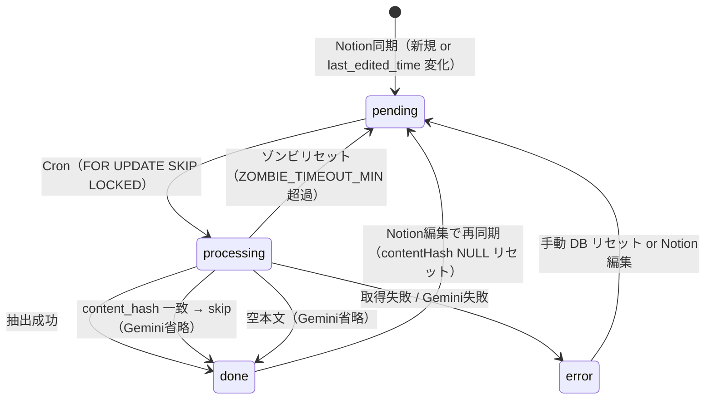

# SPEC.md — 現在の実装仕様

> このドキュメントは **実装済みの仕様のみ** を記載する。未実装・将来構想は TODO.md / Project.md を参照。

---

## システム構成

```
Notion DB
  ↓ Notion API（database query / blocks API）
Next.js 15 App Router（Vercel）
  ↓ Gemini API（gemini-2.5-flash）
Supabase PostgreSQL（notion_ai スキーマ）
```

Vercel Cron が毎日 3:00 UTC に `/api/cron/extract` を呼び出す。

---

## 使用技術

| 項目 | 採用技術 |
|------|---------|
| フレームワーク | Next.js 15 App Router |
| 言語 | TypeScript |
| DB | Supabase PostgreSQL |
| ORM | Drizzle ORM |
| DB クライアント | postgres-js |
| AI | Google Gemini API (`@google/generative-ai`) |
| 実行環境 | Vercel Serverless Functions |
| スケジューラ | Vercel Cron |
| Node.js | v22 |

---

## DB スキーマ（notion_ai）

### notion_ai.pages

Notion ページの取得状態・処理状態を管理する。

| カラム | 型 | 説明 |
|--------|----|------|
| `page_id` | TEXT PK | Notion ページ ID |
| `title` | TEXT | ページタイトル（名前プロパティ） |
| `notion_date` | TEXT | Notion の日付プロパティ値（NOTION_DATE_PROPERTY で指定） |
| `company_name` | TEXT | Notion の「会社名」プロパティ値 |
| `location_name` | TEXT | Notion の「工場名・拠点名」プロパティ値 |
| `last_edited_time` | TIMESTAMPTZ | Notion の最終編集時刻（差分検出に使用） |
| `content` | TEXT | ページ本文テキスト（キャッシュ） |
| `content_hash` | TEXT | SHA-256 ハッシュ（保存済み・差分スキップへの活用は未実装） |
| `content_length` | INTEGER | 本文文字数 |
| `status` | TEXT | `pending` / `processing` / `done` / `error` |
| `error_type` | TEXT | エラー種別（構造化） |
| `error_msg` | TEXT | エラーメッセージ |
| `retry_count` | INTEGER | リトライ回数（デフォルト 0） |
| `processing_started_at` | TIMESTAMPTZ | processing セット時刻（ゾンビ検出用） |
| `processed_at` | TIMESTAMPTZ | 処理完了時刻 |
| `created_at` | TIMESTAMPTZ | レコード作成日時 |
| `updated_at` | TIMESTAMPTZ | レコード更新日時（トリガー自動更新） |

**status 遷移:**

```
pending → processing → done
                    → error  （自動復帰なし）
processing ──────────────→ pending  （ゾンビリセット: ZOMBIE_TIMEOUT_MIN 分超過）
```

**error 時の挙動:** Cron は `pending` のみを対象にする。`error` は自動的に `pending` に戻らない。
再試行するには (a) Notion 側でページを更新して `last_edited_time` を変化させる、
または (b) DB で手動リセット (`UPDATE SET status='pending' WHERE status='error'`) が必要。

`retry_count` はエラー発生回数の記録であり、自動再試行のトリガーには使われていない。

**ゾンビ検出:** `processing` のまま `ZOMBIE_TIMEOUT_MIN` 分以上経過したレコードを `pending` にリセット。

### notion_ai.extractions

トピック別抽出結果を管理する。

| カラム | 型 | 説明 |
|--------|----|------|
| `id` | SERIAL PK | 自動採番 |
| `page_id` | TEXT FK | notion_ai.pages.page_id（CASCADE DELETE） |
| `topic` | TEXT | トピック名 |
| `applicable` | BOOLEAN | 議事録にそのトピックの記述が実際に存在するか |
| `source_excerpt` | TEXT | 議事録原文からの直接引用（applicable=false は空文字） |
| `summary` | TEXT | 営業向け要約（applicable=false は空文字） |
| `created_at` | TIMESTAMPTZ | 作成日時 |
| `updated_at` | TIMESTAMPTZ | 更新日時（トリガー自動更新） |

`(page_id, topic)` に UNIQUE 制約あり。UPSERT で冪等書き込みを保証。

---

## Extraction ライフサイクル図



---

## API 仕様

### GET /api/health

ヘルスチェック。DB 接続確認なし。

**レスポンス:**
```json
{ "ok": true, "service": "nortion-ai", "timestamp": "2026-05-15T..." }
```

### GET /api/cron/extract

Notion 同期 → Gemini 抽出 → DB 保存を実行する。

**認証:** `Authorization: Bearer {CRON_SECRET}` ヘッダー必須。

**処理シーケンス:**

1. ゾンビリセット（`processing` のまま `ZOMBIE_TIMEOUT_MIN` 分経過したレコードを `pending` に戻す）
2. Notion DB から全ページのメタ情報を取得
3. UPSERT（新規追加 or `last_edited_time` 変化時にステータスをリセット）
4. `pending` ページを `BATCH_SIZE` 件取得（`FOR UPDATE SKIP LOCKED`）
5. 各ページ: ブロック取得 → Gemini 抽出 → extractions UPSERT → status=done
6. エラー時は status=error・error_type・error_msg・retry_count を記録

**レスポンス:**
```json
{
  "ok": true,
  "synced": 10,
  "processed": 5,
  "done": 5,
  "error": 0,
  "zombieReset": 0,
  "remaining": 0
}
```

---

## Gemini 抽出仕様

### モデル

`gemini-2.5-flash`（`GEMINI_MODEL` 環境変数で変更可能）

### トピック定義

| トピック | 対象 |
|---------|------|
| デジタル化 | IoT・データ収集・リモート監視・クラウド連携・PLC通信・設定管理のデジタル化 |
| 値上げ | 価格改定・価格交渉・コスト上昇・値上げ承認プロセス |
| 増産 | 生産量増加・ライン増設・新設備導入・稼働率向上・キャパシティ拡大 |
| 自動化 | 手作業の機械化・省人化・センサーやロボットによる工程自動化（顧客ニーズ） |
| 困りごと | 設備トラブル・業務課題・不満・要望・障害（顧客が直面している問題） |

### applicable 判定ルール

- 議事録にそのトピックの記述が実際に存在する → `true`
- 記述なし、または背景情報・他社事例のみ → `false`
- `applicable=false` の場合、`source_excerpt` と `summary` は空文字

### トピック優先ルール

1 記述が複数トピックに該当する場合は最も直接的なトピックのみに割り当て。例：「値上げ承認ルートが複雑」→ 値上げ（困りごとには含めない）。

### responseSchema

```typescript
{
  applicable:     boolean,
  source_excerpt: string,  // 議事録原文からの直接引用
  summary:        string,  // 顧客温度感・商談可能性・推奨アクション含む 2〜3 文
}
```

### リトライ

指数バックオフ（最大 3 回）。対象: HTTP 429・5xx・ネットワークエラー。

---

## Notion 同期仕様

### 差分検出

`last_edited_time` を比較し、変化があった場合のみ `status=pending` にリセットして再処理。

### 日付プロパティ

1. `NOTION_DATE_PROPERTY` 環境変数で指定したプロパティを優先
2. 見つからなければ `date` 型プロパティを自動探索
3. それでも見つからなければ `notionDate=null` で処理継続
4. `NOTION_DATE_PROPERTY` が空文字の場合は sort なし

### 本文取得

ページの children blocks を取得し、以下の型のテキストを結合:
`paragraph`, `heading_1-3`, `bulleted_list_item`, `numbered_list_item`, `to_do`, `toggle`, `quote`, `callout`

> **現在の制約**: ネストされた children（toggle 内の段落など）は取得しない。

---

## セキュリティ

| 保護対象 | 方法 |
|---------|------|
| `/api/cron/extract` | `Authorization: Bearer {CRON_SECRET}` ヘッダー認証 |
| `/api/health` | 認証なし（公開） |
| `/admin`, `/admin/ops`, `/admin/customers`, `/search` | httpOnly cookie（`admin_auth`）認証。SHA-256(salt + ADMIN_SECRET) トークン。 |
| `/login` | 公開。ADMIN_SECRET 照合後に cookie 発行。 |
| `/logout` | cookie 削除 → `/login` リダイレクト。 |

### 認証変数の責務分離

| 変数 | 用途 |
|------|------|
| `ADMIN_PASSWORD` | `/login` フォームのパスワード照合専用 |
| `ADMIN_SECRET` | cookie hash / session integrity 用。ログインパスワードとしては使わない |
| `CRON_SECRET` | `/api/cron/extract` 認証専用 |

### ログインパスワード変更方法

ログインパスワードは `ADMIN_PASSWORD` 環境変数で管理する。

**ローカル変更手順：**
1. `.env.local` の `ADMIN_PASSWORD` を新しい値に変更
2. dev server を再起動（`npm run dev`）
3. ブラウザの cookie（`admin_auth`）を削除するか `/logout` してから再ログイン

**本番変更手順：**
1. Vercel ダッシュボード → Settings → Environment Variables → `ADMIN_PASSWORD` を更新
2. 再デプロイ（Vercel は env var 変更後に手動 redeploy が必要）
3. ブラウザの cookie を削除するか `/logout` してから再ログイン

> **注意:** cookie は変更前の古い token を保持するため、パスワード変更後は必ず再ログインが必要。
> `ADMIN_SECRET`（cookie hash）を変更した場合も全ユーザーの再ログインが必要になる。

---

## 環境変数

| 変数 | 必須 | デフォルト |
|------|------|-----------|
| `DATABASE_URL` | ✅ | - |
| `DATABASE_URL_DIRECT` | ✅（migration 用） | - |
| `NOTION_TOKEN` | ✅ | - |
| `NOTION_DATABASE_ID` | ✅ | - |
| `NOTION_DATE_PROPERTY` | - | `"日付"` |
| `NOTION_DATABASE_VIEW_URL` | - | - |
| `GEMINI_API_KEY` | ✅ | - |
| `CRON_SECRET` | ✅ | - |
| `ADMIN_PASSWORD` | ✅ | - |
| `ADMIN_SECRET` | ✅ | - |
| `GEMINI_MODEL` | - | `gemini-2.5-flash` |
| `BATCH_SIZE` | - | `10` |
| `SLEEP_MS` | - | `1000` |
| `ZOMBIE_TIMEOUT_MIN` | - | `15` |
| `NOTION_API_VERSION` | - | `2022-06-28` |

---

## マイグレーション管理

手動 SQL 実行で統一（`drizzle-kit migrate` は使用しない）。

| ファイル | 内容 |
|---------|------|
| `drizzle/migrations/0001_init.sql` | テーブル・インデックス・トリガー作成 |
| `drizzle/migrations/0002_add_applicable.sql` | applicable カラム追加 |
| `drizzle/migrations/0003_add_processed_at_index.sql` | processed_at DESC インデックス追加 |
| `drizzle/migrations/0004_add_company_name.sql` | company_name カラム追加 |
| `drizzle/migrations/0005_add_location_name.sql` | location_name カラム追加 |

`drizzle.config.ts` は存在するが `drizzle-kit migrate` は使用しない。このファイルは `drizzle-kit studio`（DB GUI）専用。
Migration はすべて上記 SQL ファイルを Supabase SQL Editor に手動適用する。

---

## DB接続設計

### runtime 接続（アプリケーション）

| 項目 | 設定 |
|------|------|
| 環境変数 | `DATABASE_URL` |
| ポート | 6543（Supabase Transaction Pooler） |
| `max` | 1（Vercel Serverless は接続数を最小限に） |
| `prepare` | false（Transaction Pooler は Prepared Statement 非対応） |

Vercel Serverless は各リクエストで独立プロセスが立ち上がる。接続を複数持つと Supabase 側の接続数上限を超えやすいため `max: 1`。
Transaction Pooler はトランザクション単位で接続を割り当てるため、セッションスコープの Prepared Statement は使用不可（`prepare: false` が必須）。

### migration 接続（開発時）

| 項目 | 設定 |
|------|------|
| 環境変数 | `DATABASE_URL_DIRECT` |
| ポート | 5432（Supabase Direct Connection） |
| 用途 | Supabase SQL Editor での手動実行 |

DDL（CREATE TABLE / CREATE INDEX）は Transaction Pooler 経由で実行すると失敗する場合があるため、Direct Connection を使用する。
Vercel 本番環境からは不要（migration は手動実行のみ）。

### 管理 UI のクエリ実行方式

`/admin` ページは4つの DB クエリを **逐次実行（sequential await）** している。

当初は `Promise.all` で並列実行していたが、コールド接続時に Supabase の statement timeout が頻発した。
原因は `max: 1` 接続下で複数クエリが同時キューに積まれ、Transaction Pooler 側で接続割り当て競合が発生すること。
逐次実行ではコールド時も安定して 200 を返す（ウォーム時の速度差 ~60ms は許容範囲）。

この設計は入口画面の安定性優先の判断であり、API Route など他箇所には適用しない。

---

## content_hash による Gemini extraction skip

### skip 発動条件（全条件を満たす場合のみ）

| 条件 | 内容 |
|------|------|
| `pages.contentHash IS NOT NULL` | 過去に処理済みで hash が保存されている |
| `pages.contentHash === 新規取得ハッシュ` | 本文テキストに変化なし |
| `text.trim() !== ''` | 空本文でないこと（空本文パスは別途 done 扱い） |
| `extractions 件数 === TOPICS.length` | 全トピックの抽出結果が既に存在すること |

### skip 時の挙動

- `status = done` に更新（`processed_at` は更新しない）
- Gemini API 呼び出しを省略
- ログ: `[extract] skipped unchanged page: { pageId, title }`
- Cron レスポンスの `skipped` フィールドにカウント

### skip が発動しないケース

- トピック定義（`TOPICS`）が変更された → `extractions 件数 !== TOPICS.length` になるため再抽出される
- Gemini プロンプト・モデルのバージョンを変更した場合は、**自動的に再抽出されない**。  
  再抽出が必要な場合は DB で手動リセット:
  ```sql
  UPDATE notion_ai.pages SET status='pending', content_hash=NULL WHERE status='done';
  ```

---

## content_hash の役割と現状

`content_hash` は Notion ページ本文テキストの SHA-256 ハッシュ。`notionClient.fetchPageContent()` で生成し、`pages.content_hash` に保存する。

**現状の動作:**

- `done` 更新時に保存される
- `last_edited_time` が変化した場合、`content_hash` は NULL にリセットされ再処理される
- **保存のみ。現在はハッシュ比較による差分スキップのロジックは未実装**

`last_edited_time` が変化しても本文が実際には変わっていないケースでも再抽出が走る。

**将来の用途（Phase 3）:**

embeddings / RAG を追加する際、`content_hash` が重要になる。

- 本文が変わっていなければ embedding 再生成をスキップ → Gemini / Embedding API コスト削減
- `last_edited_time` 変化とは独立した「本文変化」検出が可能
- embedding のキャッシュ無効化トリガーとして機能する

現時点では「将来の差分管理のために保存している」フィールドとして扱う。

---

## 管理ページの役割分担

| ページ | 役割 | 対象ユーザー |
|-------|------|------------|
| `/admin` | 営業・訪問状況ダッシュボード | 営業担当・マネージャー |
| `/admin/ops` | extraction / cron 運用監視 | システム管理者 |
| `/admin/customers` | 顧客別 topic 一覧 | 営業担当 |
| `/search` | キーワード検索 | 全員 |

`pending` / `error` などの処理状態は `/admin/ops` で管理し、`/admin` には表示しない。

---

## 管理ダッシュボード（/admin）の集計表示

### サマリーカード

| カード | 集計 |
|-------|------|
| 訪問件数 ※議事録有 | `status='done' AND notion_date IS NOT NULL` |
| 会社数 | `count(DISTINCT company_name)` where `status='done'` |
| topic 抽出件数（applicable） | `applicable=true` の extraction 合計件数 |
| 最終処理日 | `max(processed_at)` |

### 表示順

| # | セクション | 集計基準 |
|---|-----------|---------|
| 1 | 全体サマリー | 訪問件数・会社数・topic抽出件数・最終処理日 |
| 2 | 週別訪問件数 | `notion_date` 基準・直近12週（`processed_at` は使わない） |
| 3 | 会社別議事録件数 | `company_name` 基準・横スクロールカード形式 |
| 4 | topic 別件数 | `applicable=true` の extraction 件数 |
| 5 | 時系列推移 | `notion_date` × `topic` × `applicable=true` の月別クロス集計 |

- 競合出現頻度は `/admin` から非表示（`getCompetitorFrequency` 関数は `queries.ts` に残存）
- `company_name` は Notion の「会社名」プロパティを cron 同期時に保存
- `location_name` は Notion の「工場名・拠点名」プロパティを cron 同期時に保存
- `/admin` は軽量性優先。重い集計・分析は `/admin/trends` などの別ページへ分離する
- `/admin` は軽量性優先。重い集計・分析クエリは `/admin/trends` などの別ページへ分離する

---

## 現在の制約

- ネストされた Notion ブロック（toggle 内など）は本文取得対象外
- 管理画面・検索画面は未実装
- `/admin` / `/search` のアクセス保護は未実装
- 全文検索は ILIKE のみ（pg_trgm / pgvector 未導入）
- ページ数が多い場合、1回の Cron で全件処理できない（`BATCH_SIZE` 制限あり）
