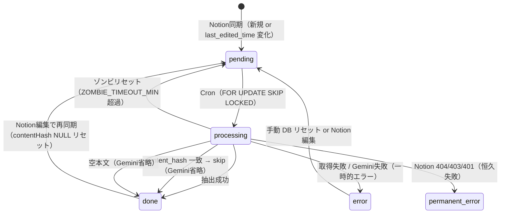

# SPEC.md — 現在の実装仕様

> このドキュメントは **実装済みの仕様のみ** を記載する。未実装・将来構想は `docs/TODO.md` / `docs/Project.md` を参照。

---

## システム構成

```
Notion DB
  ↓ Notion API（database query / blocks API）
Next.js 15 App Router（Vercel）
  ↓ Gemini API（gemini-2.5-flash: トピック抽出）
  ↓ Gemini API（gemini-embedding-001: embedding生成）
Supabase PostgreSQL（notion_ai スキーマ / pgvector）
```

Vercel Cron が毎日 3:00 UTC に `/api/cron/extract` を呼び出す（JST 土日はスキップ）。

---

## 使用技術

| 項目 | 採用技術 |
|------|---------|
| フレームワーク | Next.js 15 App Router |
| 言語 | TypeScript |
| DB | Supabase PostgreSQL |
| ORM | Drizzle ORM |
| DB クライアント | postgres-js |
| AI | Google Gemini API (`@google/generative-ai`) |
| 実行環境 | Vercel Serverless Functions |
| スケジューラ | Vercel Cron |
| Node.js | v22 |

---

## DB スキーマ（notion_ai）

### notion_ai.pages

Notion ページの取得状態・処理状態を管理する。

| カラム | 型 | 説明 |
|--------|----|------|
| `page_id` | TEXT PK | Notion ページ ID |
| `title` | TEXT | ページタイトル（名前プロパティ） |
| `notion_date` | TEXT | Notion の日付プロパティ値（NOTION_DATE_PROPERTY で指定） |
| `company_name` | TEXT | Notion の「会社名」プロパティ値 |
| `location_name` | TEXT | Notion の「工場名・拠点名」プロパティ値 |
| `last_edited_time` | TIMESTAMPTZ | Notion の最終編集時刻（差分検出に使用） |
| `content` | TEXT | ページ本文テキスト（キャッシュ） |
| `content_hash` | TEXT | 本文テキストの SHA-256 ハッシュ（Gemini extraction skip の判定に使用） |
| `content_length` | INTEGER | 本文文字数 |
| `status` | TEXT | `pending` / `processing` / `done` / `error` / `permanent_error` |
| `error_type` | TEXT | エラー種別（構造化） |
| `error_msg` | TEXT | エラーメッセージ |
| `retry_count` | INTEGER | リトライ回数（デフォルト 0） |
| `processing_started_at` | TIMESTAMPTZ | processing セット時刻（ゾンビ検出用） |
| `processed_at` | TIMESTAMPTZ | 処理完了時刻 |
| `embedding` | vector(768) | ページ本文の埋め込みベクトル（gemini-embedding-001 の先頭768次元） |
| `created_at` | TIMESTAMPTZ | レコード作成日時 |
| `updated_at` | TIMESTAMPTZ | レコード更新日時（トリガー自動更新） |

**status 遷移:**

```
pending → processing → done
                    → error          （一時的エラー。自動復帰なし）
                    → permanent_error（恒久失敗: 404/403 等。自動復帰不可・次回 cron 対象外）
processing ──────────────→ pending  （ゾンビリセット: ZOMBIE_TIMEOUT_MIN 分超過）
```

**error 時の挙動:** `error` は自動的に `pending` に戻らない。
再試行するには (a) Notion 側でページを更新して `last_edited_time` を変化させる、
または (b) DB で手動リセット（`UPDATE SET status='pending' WHERE status='error'`）が必要。

**permanent_error 時の挙動:** Notion API の 404（ページ不存在）・403/401（アクセス権限なし）等の恒久失敗。
`retry_count` は増やさない。次回 Cron の処理対象（`pending` / `done`）から自動除外される。
ゾンビ検出（`processing` 対象）・Retry Warnings からも除外。
手動での `status='pending'` リセットが必要。

`retry_count` はエラー発生回数の記録であり、自動再試行のトリガーには使われていない。

**ゾンビ検出:** `processing` のまま `ZOMBIE_TIMEOUT_MIN` 分以上経過したレコードを `pending` にリセット。

### notion_ai.extractions

トピック別抽出結果を管理する。

| カラム | 型 | 説明 |
|--------|----|------|
| `id` | SERIAL PK | 自動採番 |
| `page_id` | TEXT FK | notion_ai.pages.page_id（CASCADE DELETE） |
| `topic` | TEXT | トピック名 |
| `applicable` | BOOLEAN | 議事録にそのトピックの記述が実際に存在するか |
| `source_excerpt` | TEXT | 議事録原文からの直接引用（applicable=false は空文字） |
| `summary` | TEXT | 営業向け要約（applicable=false は空文字） |
| `created_at` | TIMESTAMPTZ | 作成日時 |
| `updated_at` | TIMESTAMPTZ | 更新日時（トリガー自動更新） |

`(page_id, topic)` に UNIQUE 制約あり。UPSERT で冪等書き込みを保証。

---

## Extraction ライフサイクル図



---

## API 仕様

### GET /api/health

ヘルスチェック。DB 接続確認なし。

**レスポンス:**
```json
{ "ok": true, "service": "nortion-ai", "timestamp": "2026-05-15T..." }
```

### GET /api/cron/extract

Notion 同期 → Gemini 抽出 → DB 保存を実行する。Vercel Function `maxDuration = 60`（秒）。

**認証:** `Authorization: Bearer {CRON_SECRET}` ヘッダー、または `?secret={CRON_SECRET}` クエリパラメータのいずれか。

**JST 土日スキップ:**

`Intl.DateTimeFormat` で `Asia/Tokyo` 基準の曜日を判定し、土曜・日曜の場合は即座に以下を返して処理を終了する。Notion API / Gemini API / DB への重処理は一切実行しない。

```json
{ "ok": true, "skipped": true, "reason": "weekend_jst" }
```

> Vercel Cron 自体は UTC で実行されるため、必ず JST 変換後の曜日で判定する。
> 手動で `/api/cron/extract` を叩く場合も同様に土日はスキップされる。

**処理シーケンス（JST 平日のみ）:**

1. ゾンビリセット（`processing` のまま `ZOMBIE_TIMEOUT_MIN` 分経過したレコードを `pending` に戻す）
2. Notion DB から全ページのメタ情報を取得
3. UPSERT（新規追加 or `last_edited_time` 変化時にステータスをリセット）
4. `pending` ページ、および `status=done` かつ `embedding IS NULL` のページを最大 `BATCH_SIZE` 件取得（`FOR UPDATE SKIP LOCKED`）
5. 各ページ: ブロック取得 → content_hash 比較 → Gemini トピック抽出（skip可） → extractions UPSERT → Gemini embedding 生成（skip可） → status=done
6. 空本文ページは Gemini をスキップして status=done（embedding なし）
7. エラー時: retryable → status=error・retry_count+1、non-retryable → status=permanent_error（retry_count は変えない）

**レスポンス（通常実行時）:**
```json
{
  "ok": true,
  "synced": 10,
  "processed": 5,
  "done": 5,
  "skipped": 0,
  "error": 0,
  "embedded": 3,
  "zombieReset": 0,
  "remaining": 0,
  "missingEmbedding": 0
}
```

> `skipped`: extraction・embedding ともに skip したページ数（content_hash 一致 + extractions 全件存在 + embedding 保存済み）。  
> `embedded`: 今回の実行で embedding を新規生成したページ数。  
> `missingEmbedding`: 処理後も `embedding IS NULL` の done ページ数（次回 cron で処理される）。  
> `error`: `error` と `permanent_error` 両方の合計件数。

---

## Notion API エラー分類（retryable / non-retryable）

Notion ブロック取得時のエラーを `NotionApiError` クラスで分類し、cron の処理分岐に使用する。

| HTTP ステータス | 分類 | error_type | 動作 |
|---------------|------|-----------|------|
| 404 | non-retryable | `NOTION_NOT_FOUND` | `permanent_error`（retry_count 変えない） |
| 403 / 401 | non-retryable | `NOTION_UNAUTHORIZED` | `permanent_error`（retry_count 変えない） |
| その他 4xx | retryable | `NOTION_FETCH` | `error`（retry_count+1） |
| 429 | retryable | `GEMINI_RATE_LIMIT` | `error`（retry_count+1） |
| 5xx | retryable | `GEMINI_API` | `error`（retry_count+1） |
| ネットワークエラー | retryable | `UNKNOWN` | `error`（retry_count+1） |

**non-retryable の判定:** `NotionApiError.isNonRetryable === true`（`geminiClient.isNonRetryable(err)` で確認）。

**non-retryable の対象ケース:**
- Notion の Integration に共有されていないページ
- 削除済みのページ（Notion 側で404になる）
- アクセス権限がないページ（403/401）

---

## Gemini 抽出仕様

### トピック抽出モデル

`gemini-2.5-flash`（`GEMINI_MODEL` 環境変数で変更可能）

### Embedding モデル

`gemini-embedding-001`（`GEMINI_EMBEDDING_MODEL` 環境変数で変更可能）

API から 3072 次元のベクトルを受け取り、先頭 768 次元に切り詰めて `vector(768)` として保存する。  
Matryoshka 方式の設計のため先頭 N 次元でも意味的に有効。

| 項目 | 値 |
|------|---|
| API 返却次元数 | 3072 |
| DB 保存次元数 | 768（`.slice(0, 768)`） |
| taskType | `RETRIEVAL_DOCUMENT` |
| リトライ | 指数バックオフ（最大3回）。429・5xx・ネットワークエラーが対象 |

runtime check: `values.length !== 768` の場合はエラーを throw（source が 768 次元未満の異常検出用）  
初回のみログ: `[embedding] sourceDim=3072 storedDim=768`

### トピック定義

| トピック | 対象 |
|---------|------|
| デジタル化 | IoT・データ収集・リモート監視・クラウド連携・PLC通信・設定管理のデジタル化 |
| 値上げ | 価格改定・価格交渉・コスト上昇・値上げ承認プロセス |
| 増産 | 生産量増加・ライン増設・新設備導入・稼働率向上・キャパシティ拡大 |
| 自動化 | 手作業の機械化・省人化・センサーやロボットによる工程自動化（顧客ニーズ） |
| 困りごと | 設備トラブル・業務課題・不満・要望・障害（顧客が直面している問題） |

### applicable 判定ルール

- 議事録にそのトピックの記述が実際に存在する → `true`
- 記述なし、または背景情報・他社事例のみ → `false`
- `applicable=false` の場合、`source_excerpt` と `summary` は空文字

### トピック優先ルール

1 記述が複数トピックに該当する場合は最も直接的なトピックのみに割り当て。例：「値上げ承認ルートが複雑」→ 値上げ（困りごとには含めない）。

### responseSchema

```typescript
{
  applicable:     boolean,
  source_excerpt: string,  // 議事録原文からの直接引用
  summary:        string,  // 顧客温度感・商談可能性・推奨アクション含む 2〜3 文
}
```

### リトライ

指数バックオフ（最大 3 回）。対象: HTTP 429・5xx・ネットワークエラー。

---

## Notion 同期仕様

### 差分検出

`last_edited_time` を比較し、変化があった場合のみ `status=pending` にリセットして再処理。

**company_name / location_name の特例更新:**  
`last_edited_time` が変化していない場合でも、DB 上の値が `NULL` であれば Notion から取得した値で上書きする。これにより、カラム追加前から存在していた既存ページへのメタデータ初期投入が可能。

### 日付プロパティ

1. `NOTION_DATE_PROPERTY` 環境変数で指定したプロパティを優先
2. 見つからなければ `date` 型プロパティを自動探索
3. それでも見つからなければ `notionDate=null` で処理継続
4. `NOTION_DATE_PROPERTY` が空文字の場合は sort なし

### 本文取得

ページの children blocks を取得し、以下の型のテキストを結合:
`paragraph`, `heading_1-3`, `bulleted_list_item`, `numbered_list_item`, `to_do`, `toggle`, `quote`, `callout`

> **現在の制約**: ネストされた children（toggle 内の段落など）は取得しない。

---

## セキュリティ

| 保護対象 | 方法 |
|---------|------|
| `/api/cron/extract` | `Authorization: Bearer {CRON_SECRET}` ヘッダー認証 |
| `/api/health` | 認証なし（公開） |
| `/admin`, `/admin/ops`, `/admin/customers`, `/search` | httpOnly cookie（`admin_auth`）認証。SHA-256(salt + ADMIN_SECRET) トークン。有効期限 12 時間。 |
| `/login` | 公開。ADMIN_PASSWORD 照合後に cookie 発行。 |
| `/logout` | cookie 削除 → `/login` リダイレクト。 |

### 認証変数の責務分離

| 変数 | 用途 |
|------|------|
| `ADMIN_PASSWORD` | `/login` フォームのパスワード照合専用 |
| `ADMIN_SECRET` | cookie hash / session integrity 用。ログインパスワードとしては使わない |
| `CRON_SECRET` | `/api/cron/extract` 認証専用 |

### ログインパスワード変更方法

ログインパスワードは `ADMIN_PASSWORD` 環境変数で管理する。

**ローカル変更手順：**
1. `.env.local` の `ADMIN_PASSWORD` を新しい値に変更
2. dev server を再起動（`npm run dev`）
3. ブラウザの cookie（`admin_auth`）を削除するか `/logout` してから再ログイン

**本番変更手順：**
1. Vercel ダッシュボード → Settings → Environment Variables → `ADMIN_PASSWORD` を更新
2. 再デプロイ（Vercel は env var 変更後に手動 redeploy が必要）
3. ブラウザの cookie を削除するか `/logout` してから再ログイン

> **注意:** cookie は変更前の古い token を保持するため、パスワード変更後は必ず再ログインが必要。
> `ADMIN_SECRET`（cookie hash）を変更した場合も全ユーザーの再ログインが必要になる。

---

## 環境変数

| 変数 | 必須 | デフォルト |
|------|------|-----------|
| `DATABASE_URL` | ✅ | - |
| `DATABASE_URL_DIRECT` | ✅（migration 用） | - |
| `NOTION_TOKEN` | ✅ | - |
| `NOTION_DATABASE_ID` | ✅ | - |
| `NOTION_DATE_PROPERTY` | - | `"日付"` |
| `NOTION_DATABASE_VIEW_URL` | - | - |
| `GEMINI_API_KEY` | ✅ | - |
| `CRON_SECRET` | ✅ | - |
| `ADMIN_PASSWORD` | ✅ | - |
| `ADMIN_SECRET` | ✅ | - |
| `GEMINI_MODEL` | - | `gemini-2.5-flash` |
| `GEMINI_EMBEDDING_MODEL` | - | `gemini-embedding-001` |
| `BATCH_SIZE` | - | `10` |
| `SLEEP_MS` | - | `1000` |
| `ZOMBIE_TIMEOUT_MIN` | - | `15` |
| `NOTION_API_VERSION` | - | `2022-06-28` |

---

## マイグレーション管理

手動 SQL 実行で統一（`drizzle-kit migrate` は使用しない）。

| ファイル | 内容 |
|---------|------|
| `drizzle/migrations/0001_init.sql` | テーブル・インデックス・トリガー作成 |
| `drizzle/migrations/0002_add_applicable.sql` | applicable カラム追加 |
| `drizzle/migrations/0003_add_processed_at_index.sql` | processed_at DESC インデックス追加 |
| `drizzle/migrations/0004_add_company_name.sql` | company_name カラム追加 |
| `drizzle/migrations/0005_add_location_name.sql` | location_name カラム追加 |
| `drizzle/migrations/0006_add_embedding.sql` | pgvector 拡張有効化・embedding vector(768) カラム追加 |

`drizzle.config.ts` は存在するが `drizzle-kit migrate` は使用しない。このファイルは `drizzle-kit studio`（DB GUI）専用。
Migration はすべて上記 SQL ファイルを Supabase SQL Editor に手動適用する。

> **`permanent_error` について:** `status` カラムは TEXT 型で CHECK 制約なし。新ステータス値の追加にマイグレーションは不要。

---

## DB接続設計

### runtime 接続（アプリケーション）

| 項目 | 設定 |
|------|------|
| 環境変数 | `DATABASE_URL` |
| ポート | 6543（Supabase Transaction Pooler） |
| `max` | 1（Vercel Serverless は接続数を最小限に） |
| `prepare` | false（Transaction Pooler は Prepared Statement 非対応） |
| `connect_timeout` | 20秒（TCP 接続ハング時に Vercel 300s 上限まで待ち続けない） |

Vercel Serverless は各リクエストで独立プロセスが立ち上がる。接続を複数持つと Supabase 側の接続数上限を超えやすいため `max: 1`。
Transaction Pooler はトランザクション単位で接続を割り当てるため、セッションスコープの Prepared Statement は使用不可（`prepare: false` が必須）。

### migration 接続（開発時）

| 項目 | 設定 |
|------|------|
| 環境変数 | `DATABASE_URL_DIRECT` |
| ポート | 5432（Supabase Direct Connection） |
| 用途 | Supabase SQL Editor での手動実行 |

DDL（CREATE TABLE / CREATE INDEX）は Transaction Pooler 経由で実行すると失敗する場合があるため、Direct Connection を使用する。
Vercel 本番環境からは不要（migration は手動実行のみ）。

### 管理 UI のクエリ実行方式

`/admin` ページは4つの DB クエリを **逐次実行（sequential await）** している。

当初は `Promise.all` で並列実行していたが、コールド接続時に Supabase の statement timeout が頻発した。
原因は `max: 1` 接続下で複数クエリが同時キューに積まれ、Transaction Pooler 側で接続割り当て競合が発生すること。
逐次実行ではコールド時も安定して 200 を返す（ウォーム時の速度差 ~60ms は許容範囲）。

この設計は `/admin` に限らず、`/admin/ops` ・`/admin/customers` ・`/search` の全管理ページに適用する。`max: 1` + Supabase Transaction Pooler 環境では `Promise.all` による並列クエリが接続競合を引き起こすため、admin 系ページは全て逐次 await で実装する。

---

## content_hash による skip ロジック

extraction（トピック抽出）と embedding（ベクトル生成）の skip は独立して判定される。

### hashMatch 条件

以下を全て満たす場合に `hashMatch = true`：

| 条件 | 内容 |
|------|------|
| `pages.contentHash IS NOT NULL` | 過去に処理済みで hash が保存されている |
| `pages.contentHash === 新規取得ハッシュ` | 本文テキストに変化なし |
| `text.trim() !== ''` | 空本文でないこと |

### extraction skip 条件

`hashMatch === true` かつ `extractions 件数 === TOPICS.length`（全トピック存在）

### embedding skip 条件

`hashMatch === true` かつ `pages.embedding IS NOT NULL`（embedding 保存済み）

### 全 skip（extractionSkipped && embeddingSkipped）

- `status = done` に更新（`processed_at` は更新しない）
- Gemini API 呼び出しを一切省略
- ログ: `[extract] skipped unchanged page: { pageId, title }`
- Cron レスポンスの `skipped` フィールドにカウント

### 部分 skip

- extraction のみ skip → embedding は生成する
- embedding のみ skip → extraction は実行する（hash 一致でも extractions が不足している場合）

### skip が発動しないケース

- トピック定義（`TOPICS`）が変更された → `extractions 件数 !== TOPICS.length` のため再抽出
- Gemini プロンプト・モデルを変更した場合は**自動的に再抽出されない**。手動リセットが必要:
  ```sql
  UPDATE notion_ai.pages SET status='pending', content_hash=NULL WHERE status='done';
  ```

---

## content_hash の役割

`content_hash` は Notion ページ本文テキストの SHA-256 ハッシュ。`notionClient.fetchPageContent()` で生成し、`pages.content_hash` に保存する。

**現状の動作:**

- 本文取得のたびに計算し、skip 判定に使用（skip 条件は上記「content_hash による Gemini extraction skip」参照）
- `done` 更新時に DB に保存される
- `last_edited_time` が変化した場合、UPSERT により `content_hash` は NULL にリセットされ再処理される

**embedding との連携（実装済み）:**

- `hashMatch && pages.embedding IS NOT NULL` → embedding 再生成をスキップ（API コスト削減）
- `last_edited_time` 変化 → UPSERT で `content_hash` を NULL リセット → 次回 cron で抽出・embedding を再生成

---

## /login ページ

### 表示内容

| 要素 | 内容 |
|------|------|
| タイトル | Notion営業議事録AI |
| サブタイトル | 営業議事録をAIで整理し、商談・訪問知識として活用するための管理画面です。 |
| 説明文 | Notionに蓄積された営業議事録をAIで解析し、「デジタル化」「値上げ」「増産」「自動化」「困りごと」などの重要トピックを抽出します。ログイン後は、訪問状況ダッシュボードや抽出結果の検索画面を確認できます。 |
| 補足文 | 営業担当・マネージャー向けの画面です。パスワードを入力してください。 |

認証処理は `loginAction`（Server Action）が担当。`ADMIN_PASSWORD` と照合後、`setAuthCookie()` で cookie を発行して `/admin` にリダイレクト。

---

## 検索仕様（/search）

| 項目 | 仕様 |
|------|------|
| 検索対象 | `pages.title` / `pages.content` / `extractions.summary` / `extractions.source_excerpt` |
| 検索方式 | ILIKE（大文字小文字無視） |
| フィルタ | topic（固定5種）/ applicable=true のみ |
| applicable UI 文言 | 「AIが重要と判断した内容のみ」（内部カラム名は `applicable` のまま） |
| 結果件数上限 | 100件（`processedAt DESC` 順） |
| 検索前 | 結果は表示しない（フォーム送信後のみ実行） |

### レスポンシブ対応

| 画面幅 | レイアウト |
|--------|----------|
| md 以上（PC） | テーブル表示（タイトル・日付・topic・source_excerpt・summary・処理日時） |
| md 未満（スマホ） | カード表示 |

**スマホカード表示項目:** タイトル / topic バッジ / 会社名・拠点名 / 日付 / applicable バッジ（「AIが重要と判断」）/ summary（最大4行）/ source_excerpt（最大3行）/ 処理日 / Notion本文リンク

**Notion本文リンク:** `https://www.notion.so/{pageId（ダッシュ除去）}` を DB の `page_id` から生成

---

## 顧客別 Topic 一覧仕様（/admin/customers）

| 項目 | 仕様 |
|------|------|
| 表示対象 | `applicable=true` の extractions のみ |
| 件数切替 | 30件（デフォルト）/ 100件 / 全件（URL param: `?limit=30\|100\|all`） |
| ソート列 | title / notionDate / topic / processedAt（Whitelist 方式） |
| ソート方向 | asc / desc（URL param: `?sort=notionDate&order=asc`） |
| デフォルトソート | `processedAt DESC` |
| summary / source_excerpt | ソート対象外 |

### レスポンシブ対応

| 画面幅 | レイアウト |
|--------|----------|
| md 以上（PC） | テーブル表示（タイトル・日付・topic・summary・source_excerpt・処理日時） |
| md 未満（スマホ） | カード表示 + ソートボタン |

**スマホカード表示項目:** タイトル / topic バッジ / 会社名・拠点名 / 日付 / summary（最大4行）/ source_excerpt（最大3行）/ 処理日 / Notion本文リンク

**スマホ用ソートボタン:** 処理日 / 日付 / タイトル / topic（URL パラメータ方式で動作、PC と共通）

**Notion本文リンク:** `https://www.notion.so/{pageId（ダッシュ除去）}` を DB の `page_id` から生成

---

## 管理ページの役割分担

| ページ | 役割 | 対象ユーザー |
|-------|------|------------|
| `/admin` | 営業・訪問状況ダッシュボード | 営業担当・マネージャー |
| `/admin/ops` | extraction / cron 運用監視 | システム管理者 |
| `/admin/customers` | 顧客別 topic 一覧 | 営業担当 |
| `/search` | キーワード検索 | 全員 |

`pending` / `error` などの処理状態は `/admin/ops` で管理し、`/admin` には表示しない。

---

## 管理ダッシュボード（/admin）の集計表示

### サマリーカード

| カード | 集計 |
|-------|------|
| 訪問件数 ※議事録有 | `status='done' AND notion_date IS NOT NULL AND notion_date != ''` |
| 会社数 | `count(DISTINCT company_name)` where `status='done' AND company_name IS NOT NULL` |
| topic 抽出個数 | `applicable=true` の extraction 合計件数 |
| 最終処理日 | `max(processed_at)` |

### 表示順

| # | セクション | 集計基準 | 件数制限 |
|---|-----------|---------|---------|
| 1 | 全体サマリー | 訪問件数・会社数・topic抽出個数・最終処理日 | - |
| 2 | 週別訪問件数 | `notion_date` 基準（`processed_at` は使わない） | 直近12週 |
| 3 | 会社別議事録件数 | `company_name` 基準・件数降順 | 上位30社 |
| 4 | topic 別件数 | `applicable=true` の extraction 件数 | - |
| 5 | 時系列推移 | `notion_date` × `topic` × `applicable=true` の月別クロス集計 | - |

- 競合出現頻度は `/admin` から非表示（`getCompetitorFrequency` 関数は `queries.ts` に残存）
- `company_name` は Notion の「会社名」プロパティを cron 同期時に保存
- `location_name` は Notion の「工場名・拠点名」プロパティを cron 同期時に保存
- `/admin` は軽量性優先。重い集計・分析クエリは将来的に `/admin/trends` などの別ページへ分離する

---

## 運用監視仕様（/admin/ops）

### セクション構成

| # | セクション | 内容 |
|---|-----------|------|
| 1 | Extraction Health Summary | ステータス別件数カード（total / done / pending / error / processing / permanent_error / 最終処理） |
| 2 | Remaining Work | 残件カード（pending / error / permanent_error / processing / zombie候補） |
| 3 | Daily Summary | 直近14日の日別集計テーブル |
| 4 | Newly Loaded Pages | 直近20件の新規取込ページ一覧 |
| 5 | Recent Error Pages | error + permanent_error 最新10件 |
| 6 | Retry Warnings | retry_count 上位10件（permanent_error 除く） |

### Daily Summary（直近14日）

`generate_series` で14日分の日付を生成し、LEFT JOIN で各日の集計を結合。活動がない日もゼロ行で表示する。

| 列 | 集計基準 |
|----|---------|
| 日付 | `generate_series(current_date - 13 days, current_date)` |
| 新規取込 | `created_at::date` = その日 |
| 処理 | `processed_at::date` = その日 |
| done | `processed_at::date` = その日 AND `status='done'` |
| error | `processed_at::date` = その日 AND `status IN ('error','permanent_error')` |
| retry ⚠ | `processed_at::date` = その日 AND `retry_count > 0` AND `status != 'permanent_error'` |
| stuck | `processing_started_at::date` = その日 AND 現在も `status='processing'`（zombie候補） |
| last processed | `max(processed_at)` その日分 |

### Newly Loaded Pages（直近20件）

`ORDER BY created_at DESC LIMIT 20`。

表示項目: タイトル / Notion日付 / status / retry_count / 取込日時（created_at）/ 処理日時（processed_at）/ error_type

### Recent Error Pages

`status IN ('error', 'permanent_error')` を対象に `updated_at DESC` で10件取得。

| 列 | 説明 |
|----|------|
| タイトル | ページタイトル |
| status | error / permanent_error をバッジ表示 |
| Notion日付 | ページ自体の日付（notion_date） |
| エラー検出日時 | updated_at（トリガー更新のためエラー記録時刻と一致） |
| retry | retry_count |
| error_type | NOTION_NOT_FOUND / NOTION_UNAUTHORIZED / GEMINI_API 等 |
| error_msg | エラーメッセージ詳細 |

> 旧仕様では「日付」列が `notion_date`（ページの日付）のみだったため、エラーが発生した日との混同があった。
> `updated_at`（エラー検出日時）と `notion_date`（ページ日付）を明確に分離した。

### Retry Warnings

`retry_count > 0 AND status != 'permanent_error'` を条件に `retry_count DESC` 上位10件。

`permanent_error` は retry 対象外のため除外する（retry_count が高くても恒久失敗として扱う）。

---

## 管理ダッシュボード（/admin）の集計表示

---

## 現在の制約

- ネストされた Notion ブロック（toggle 内の段落など）は本文取得対象外
- キーワード検索は ILIKE のみ（pgvector の類似検索は未実装）
- ページ数が多い場合、1回の Cron で全件処理できない（`BATCH_SIZE` 制限あり）
- Gemini プロンプト・モデルを変更した場合は自動再抽出されない（手動でステータスリセットが必要）
- `error` になったページの自動復帰なし（Notion 編集または手動 DB リセットが必要）
- `permanent_error` の自動復帰なし（手動で `status='pending'` にリセットが必要）
- embedding は保存済みだが類似検索 UI・HNSW インデックスは未実装
- Cron は JST 土日スキップのため、土日に手動実行しても処理されない（認証後にスキップレスポンスを返す）
